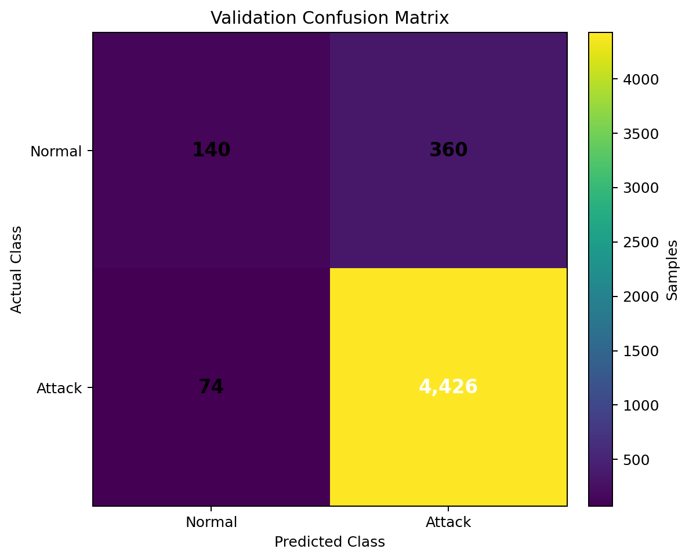

# cyberSentinel

## Network Intrusion Detection System

cyberSentinel is an end-to-end machine learning pipeline for classifying structured network traffic as **normal** or **attack**.

## Problem Statement

Network traffic contains flow-level signals that can be used to identify malicious activity. The objective is to build a binary intrusion detection model that:

- processes structured network flow telemetry,
- distinguishes normal traffic from malicious traffic,
- produces attack probabilities,
- converts probabilities into `normal` or `attack` predictions,
- generates a submission file containing the sample ID, predicted class, and confidence.

### Dataset

The project uses network-flow data with 20 numeric features and a `label` column.

- Training data: 24,000 rows
- Validation data: 5,000 rows
- Original labels: `normal`, `fuzzer`, `analysis`, `backdoor`, `dos`, `exploit`, `generic`, `recon`, `shellcode`, `worm`
- Binary target: `normal` vs `attack`

For binary classification, every label other than `normal` is mapped to `attack`.

## Solution

### 1. Feature Audit

The training data is examined using:

- ANOVA F-test
- Mutual information

The audit is implemented in `model_training/feature_audit.py`.

### 2. Feature Engineering

The model uses five core flow features:

- `spkts`
- `dpkts`
- `sload`
- `dload`
- `ct_state_ttl`

Four additional network-flow features are derived:

- `pkt_ratio = spkts / (dpkts + epsilon)`
- `total_pkts = spkts + dpkts`
- `load_ratio = sload / (dload + epsilon)`
- `total_load = sload + dload`

The `rate` feature is excluded from the modeling feature set because of the distribution shift identified during analysis.

### 3. Model

The classifier uses `HistGradientBoostingClassifier` with regularization:

- `max_iter=150`
- `learning_rate=0.03`
- `max_leaf_nodes=15`
- `min_samples_leaf=25`
- `l2_regularization=3.0`
- `random_state=42`

The estimator is wrapped with `CalibratedClassifierCV` using 5-fold sigmoid calibration.

The operating decision threshold is **0.74** for the attack probability.

## Validation Results

The supplied validation predictions produce:

- Accuracy: **88.52%**
- Normal precision: **43.97%**
- Normal recall: **54.00%**
- Attack precision: **94.76%**
- Attack recall: **92.36%**

### Confusion Matrix

The matrix below is calculated from the supplied `validation.csv` labels and `submission.csv` predictions.



| Actual / Predicted | Normal | Attack |
|---|---:|---:|
| Normal | 270 | 230 |
| Attack | 344 | 4,156 |

## Repository Structure

```text
cyberSentinel/
├── data/
│   ├── train.csv
│   └── validation.csv
├── model_training/
│   ├── __init__.py
│   ├── data_loader.py
│   ├── feature_audit.py
│   ├── feature_engineering.py
│   ├── train_model.py
│   ├── generate_submission.py
│   └── evaluate_model.py
├── models/
│   └── .gitkeep
├── confusion_matrix.png
├── submission.csv
├── requirements.txt
├── .gitignore
└── README.md
```

## Setup

```bash
git clone <repository-url>
cd cyberSentinel

python -m venv .venv
```

Activate the environment:

### Windows

```bash
.venv\Scripts\activate
```

### Linux / macOS

```bash
source .venv/bin/activate
```

Install dependencies:

```bash
pip install -r requirements.txt
```

## Usage

Run the feature audit:

```bash
cd model_training
python feature_audit.py
```

Train and evaluate the calibrated model:

```bash
python train_model.py
```

Generate `submission.csv`:

```bash
python generate_submission.py
```

Evaluate the generated submission:

```bash
python evaluate_model.py
```

The trained model is saved locally as:

```text
models/calibrated_model.joblib
```

## Output

`submission.csv` contains:

```text
sample_id
predicted_class
confidence
```

The repository includes the supplied final `submission.csv` in the project root.
